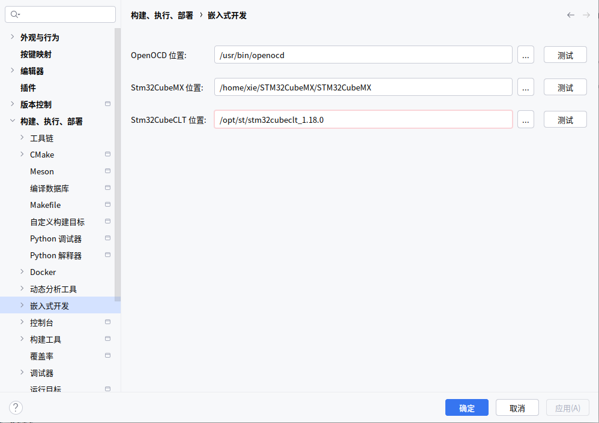
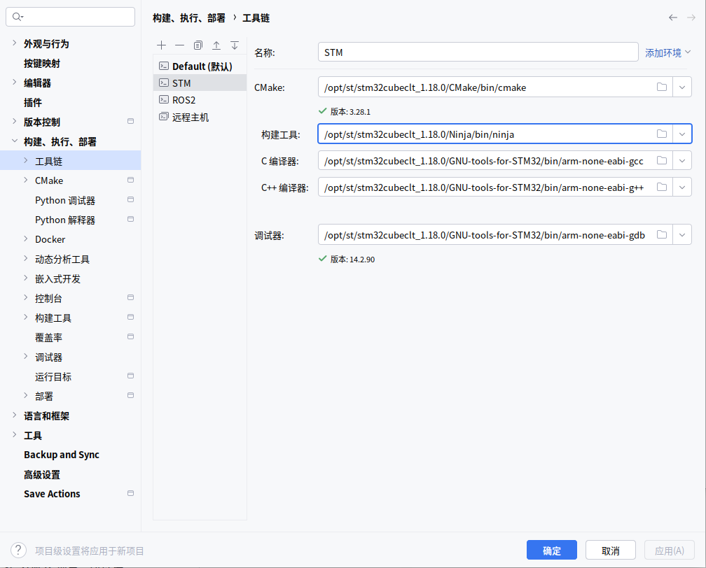
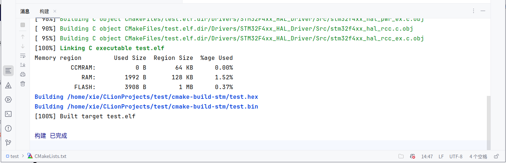
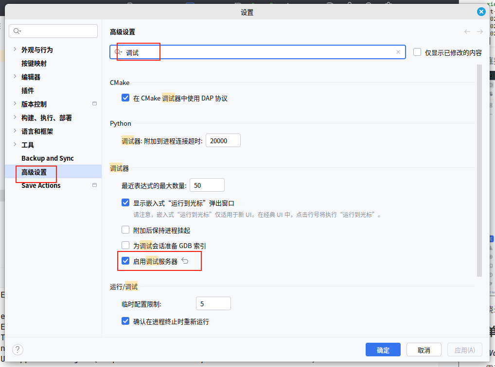
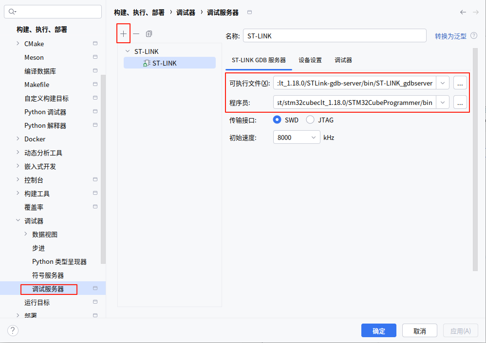
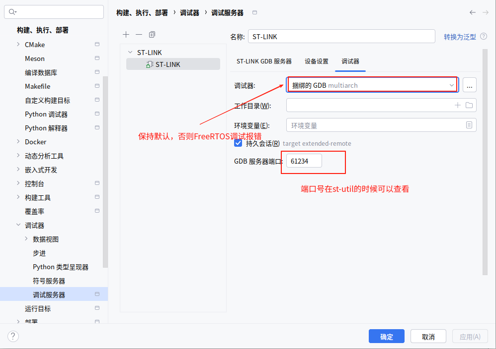
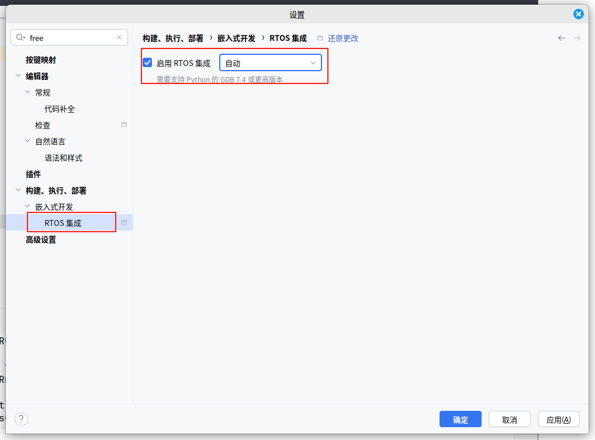

# linux新版clion使用配置stm32环境

***本教程需要使用clion2025.1以上，其他版本使用openocd或其他工具，使用opend请查阅其他教程***

***本教程基于linux,windows类似，stlink、Jlink测试成功，其他烧录器没有测试***

| 工具           | 版本              |
| ------------ | --------------- |
| CLion        | CLion 2025.1及以上 |
| STM32CubeCLT |                 |
| STM32CubeMX  |                 |
| OpenOCD      |                 |
| JLink        |                 |

## 软件的下载及安装

- CLion：新版本（2025.1.1）已经支持非商用免费，无需再找破解。

- cubemx：[STM32CubeMX - STM32Cube initialization code generator - STMicroelectronics](https://www.st.com/en/development-tools/stm32cubemx.html)

- cubeclt：[STM32CubeCLT - Toolset for third-party integrated development environment (IDE) providers, allowing the use of STMicroelectronics proprietary tools within their own IDE frameworks - STMicroelectronics](https://www.st.com/en/development-tools/stm32cubeclt.html)

- openocd

- Jlink

cubeclt包含了各种编译链工具，如`arm-none-eabi-`、`ninja`、`cmake`等

## clion环境的配置

***Warning***

首先找到`cubeclt`安装后的工具位置，`cubeclt`安装的时候会将ubuntu的`cmake`环境设置为`cubeclt`工具链里面的，如在使用终端需要修改cmake为系统本身的版本，在`bashrc`文件输入：

```bash
export PATH=/usr/bin:$PATH
```

在clion的配置如图（Windows也是找到对应的安装位置和配置即可）





## 测试环境是否正常

首先创建一个工程（以f407zgt6为例），clion通过cubemx创建文件查阅网上的资料。cubemx最后的`toolchain`选择`cmake`和`cubeide`都可以。如果没了解过`HAL`库和`cubemx`的请查阅网上资料。

如果环境正常，在clion里面构建效果如图




#### 单机程序及FreeRTOS的调试

***Warning***

需要调试`FreeRTOS`的需要按照以下设置，否则调试会报错





可执行文件：`/opt/st/stm32cubeclt_1.18.0/STLink-gdb-server/bin/ST-LINK_gdbserver`

- 程序员：`/opt/st/stm32cubeclt_1.18.0/STM32CubeProgrammer/bin`





持久会话选择关闭即可烧录后断开gdb连接，然后正常调试即可

## 烧录

连接后再烧录

### STLINK

按照上述配置后点击烧录即可

### JLINK

在调试服务器选择jlink后选择芯片型号即可，记得安装jlink程序。
