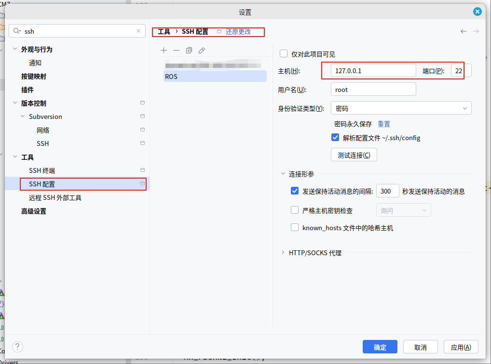
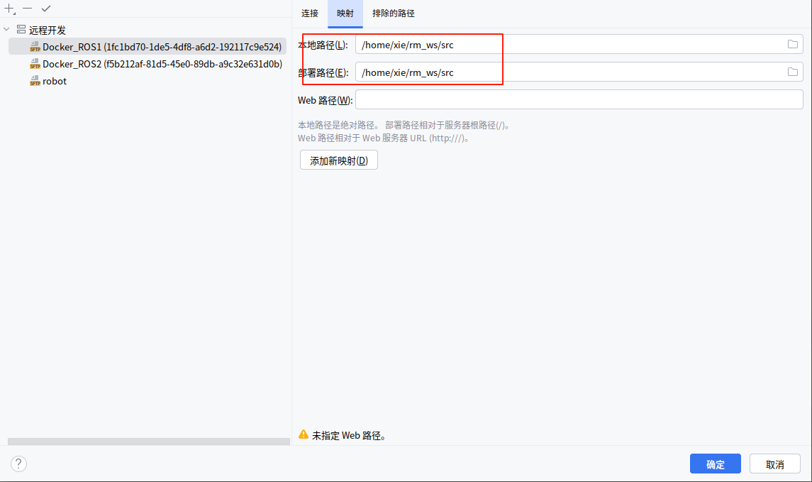

# Clion使用docker环境开发

## 注意事项

ros1的src的顶层cmakelists需要手动在主机创建，要不然clion无法访问到cmakelists。

因为ros1的顶层cmakelists是用软链接的。

## docker

### 在docker里面安装ssh(若已安装跳过）

```bash
apt install openssl openssh-server
```

然后修改ssh配置允许root登录，在docker容器内

```bash
echo "PermitRootLogin yes" >> /etc/ssh/sshd_config
```

随后一定要重启ssh服务

```bash
service ssh restart
```

### 密码设置

在docker容器内初始化root密码，用于下一步的登录，则具体操作如下，

```bash
passwd root
#根据提示输入初始密码。然后可以在本地测试链接一下
ssh root@localhost -p xx ###容器22端口映射的本地端口
```

上面的开启方法只能在终端一直开启状态下使用，一旦终端关闭重新打开就失效，如果想要开机自启动则需要进行下面操作。

```bash
#在 /root 目录下新建一个 start_ssh.sh文件，并给予该文件可执行权限。
touch /root/start_ssh.sh  
vim /root/start_ssh.sh 
chmod +x /root/start_ssh.sh
#而start_ssh.sh 脚本的内容，如下：

#!/bin/bash    
LOGTIME=$(date "+%Y-%m-%d %H:%M:%S") 
echo "[$LOGTIME] startup run..." >>/root/start_ssh.log 
service ssh start >>/root/start_ssh.log   ###其他服务也可这么实现
```

将start_ssh.sh脚本添加到启动文件中

```bash
if [ -f /root/start_ssh.sh ]; then       
    . /root/start_ssh.sh 
fi
```

保存后，可以source一下看看有没有问题，等下次重启容器的时候，添加的服务也就跟着重启了。至此docker内的配置完成了。

## Clion

使用ssh连接主机就好了。

```bash
#用户名：root
#密码：刚刚passwd的密码
```

测试连接。

创建远程主机配置，工具链选择远程主机。

顶栏工具点击重新与远程同步,修改映射即可正常使用。




